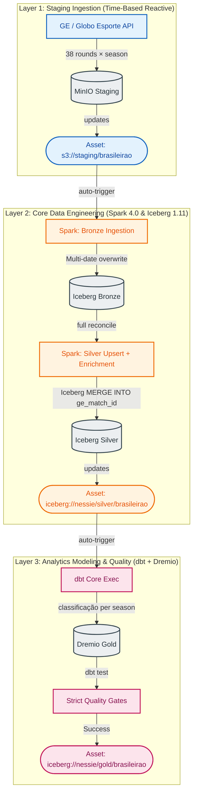

# Brasileirão Série A — Data Lakehouse Engineering Manual

[](https://github.com/gustavolatorre/data_lakehouse/actions/workflows/ci.yml)
[](#-code-quality--unit-testing)
[](pyproject.toml)
[](LICENSE)

> The coverage badge reflects the CI-enforced floor (`fail_under = 85` in `pyproject.toml`); the unit suite currently sits above it.

> **Core Stack:** Airflow 3.2.1 | Spark 4.0.0 | Apache Iceberg 1.11.0 | Project Nessie 0.107.5 | dbt Core (dbt-dremio) | Dremio 25.0.0 | MinIO

---

This project implements a **production-ready, fully reactive, and completely idempotent Data Lakehouse** engineered under the **Medallion Architecture** pattern, dedicated to **Brasileirão Série A** football data. It ingests real match data from the **Globo Esporte (GE) internal JSON API**, orchestrates event-driven processing with **Apache Airflow 3.2.1**, cleans and enriches matches via **Apache Spark 4.0.0** (natively compiled with Scala 2.13), manages transactional table state with **Apache Iceberg 1.11.0**, tracks historical lineage with **Project Nessie** (Git-like catalog semantics), and builds the analytics-ready Gold model — the league table (*classificação*) — inside **Dremio** using **dbt Core**.

> **One domain, multiple seasons.** The pipeline runs the full **Staging → Bronze → Silver → Gold** path for Brasileirão Série A. The active edition is **derived automatically from the run's year** (the GE championship UUID is stable; only the per-year slug changes), so the pipeline **rolls over to the next season with no config edit** (see [Season Turnover](#-season-turnover-automatic-roll-over)).

---

## 🏗️ Data Flow & Reactive (Asset-Aware) Architecture

Unlike legacy monolithic pipelines scheduled with arbitrary Cron expressions, this lakehouse adopts **Reactive Asset-Aware Orchestration** (native to **Airflow 3.x**). The pipeline is decoupled into three isolated DAGs that react to the physical arrival of data in S3 (MinIO) and state updates in the Nessie catalog.



---

## 💎 Deep-Dive Engineering Principles & Processes

### Why full reconcile (no watermarks)

Every layer re-processes the **complete current state** each run rather than an `execution_date` slice. An earlier date-watermark design (`ingestion_date >= MAX`) silently dropped **postponed / late-finalised** matches — a game played weeks after its scheduled round, or a score finalised out of order, has a *played date* before the latest already-processed date, so the watermark skipped it forever (this is how a whole round went missing while teams showed one game fewer). Reconciling the whole set is cheap here (~one small JSON per match-date; a few hundred rows total) and every write is idempotent (`overwritePartitions` per day, `MERGE` upsert), so out-of-order arrivals can never be lost.

### 1. Ingestion (Staging Layer)
`src/staging/fetch_brasileirao.py` reads the GE internal JSON API — the same endpoint the browser calls.
*   **Current-season, full reconcile:** for the active edition (derived from the run's year) it scans all 38 rounds, keeps only **finished** matches (official score present **and** kicked off), and writes one file per match date: `s3://staging/brasileirao/{match_date}/matches.json`.
*   **Fail-loud on partial fetches:** if any round still fails after retries (3× exponential backoff), the task raises `RuntimeError` rather than stage an incomplete season that would slip past the Bronze `row_count >= 1` gate.
*   **In-memory S3 streaming:** each date's JSON is serialized in memory and streamed straight to MinIO via the native client's `put_object` — no temp local writes.

### 2. History Preservation (Bronze Layer)
`src/bronze/ingest_brasileirao.py` is **path-driven**: a single staging run can drop many dates at once, so Bronze scans `s3a://staging/brasileirao/*/matches.json`, derives `ingestion_date` from the **file path**, and re-ingests every staged date.
*   **Idempotent overwrite (NOT append):** writes use `writeTo(...).overwritePartitions()` over a **hidden** `days(ingestion_ts)` spec, where `ingestion_ts` derives from the path date — re-running the same date atomically replaces only that partition.
*   **`ge_match_id` is a STRING** (the GE id is a UUID).
*   **Pre-write Quality Gate:** before the write commits, `src/utils/quality_runner.py` evaluates `quality/checks/bronze_brasileirao.yml` (minimal: `row_count >= 1`) against the in-memory DataFrame; a `fail` rule aborts before any Iceberg state changes.
*   **Iceberg `format-version=2` + `gc.enabled=true`:** set explicitly so maintenance can expire snapshots / remove orphan files.

### 3. Cleaning, Enrichment & Atomic UPSERT (Silver Layer)
`src/silver/transform_brasileirao.py` MERGEs the **entire** Bronze table on `ge_match_id` every run (full reconcile, no watermark).

#### A. Unicode Translation (Zero Python UDFs)
Accent removal is done with the JVM-native **`F.translate()`** — never a Python UDF (which would serialize data out of the JVM):
```python
accents = "áàâãäéèêëíìîïóòôõöúùûüç…"
plain   = "aaaaaeeeeiiiiooooouuuuc…"
df = df.withColumn("home_team", F.translate(F.col("home_team"), accents, plain))
```

#### B. Stadium → State (UF) Enrichment
Each match is enriched with its stadium's state via broadcast-joined lookup tables (`src/silver/stadium_enrichment.py`) using a cascade `stadium → home_team → __UNKNOWN__`. It also derives `total_goals` and `match_outcome` (HOME_WIN / AWAY_WIN / DRAW).

#### C. Plain UPSERT MERGE (no soft-delete)
Because a played match never disappears from the source, the Silver MERGE is a **plain upsert** — **no** `WHEN NOT MATCHED BY SOURCE` soft-delete and **no** shrink guard. Re-MERGing already-seen matches is a no-op:
```sql
MERGE INTO nessie.silver.brasileirao t
USING v_transformed s
ON t.ge_match_id = s.ge_match_id
WHEN MATCHED THEN UPDATE SET ...
WHEN NOT MATCHED THEN INSERT ...
```
The table is partitioned by `months(match_date)`. Rows with NULL `ge_match_id` are diverted to `nessie.silver.brasileirao_quarantine` (append-only, partitioned by `quarantine_date`) instead of aborting the run.

### 4. Dimensional Modeling (Gold Layer — Classificação)
Modeled in the dbt project (tagged `brasileirao`), built on Dremio over the Nessie catalog:
*   **`stg_silver_brasileirao`** (view) — reads `lakehouse.silver.brasileirao AT BRANCH main` and derives `season = extract(year from match_date)`.
*   **`int_brasileirao_partidas`** (view) — the team-match grain: each match expanded into a home and an away row (mando, gols pró/contra, V/E/D flags, pontos). A reusable base for any per-team mart.
*   **`mart_classificacao_brasileirao`** (table) — one row per `(season, team)` (jogos, V/E/D, GP/GC, saldo, pontos, aproveitamento) with `RANK() OVER (PARTITION BY season …)` on the official tie-break (points → wins → goal difference → goals for). Grain uniqueness on `(season, time_)` is enforced by the singular test `assert_classificacao_unique_season_team`.
*   **No freshness SLA:** the football calendar has multi-week planned gaps (FIFA dates, the World Cup window, the off-season), so a staleness SLA would raise false alarms. Completeness is guarded by the full-reconcile pipeline + model tests.
*   **Strict gates:** `dbt build` runs tests topologically per resource — a failing test on `stg_silver_brasileirao` skips the downstream models.

### 5. Operational Layers
*   **Declarative Quality Contracts** — `quality/checks/bronze_brasileirao.yml` (minimal) and `quality/checks/silver_brasileirao.yml` (7 fail-level invariants + 3 warn-level signals), evaluated by `src/utils/quality_runner.py` in a single Spark aggregation pass. Bronze runs them pre-write, Silver post-MERGE.
*   **Weekly Iceberg Maintenance** — the `iceberg_maintenance` DAG (`@weekly`) runs `rewrite_data_files` (compaction), `expire_snapshots` (retention 30 days, keep ≥5), and `remove_orphan_files` against the Bronze, Silver, and quarantine tables. Every Spark task in the project submits through a single shared `spark_worker` pool (`slots=1`), so only one job ever hits the 2GB worker at a time.
*   **OpenLineage (opt-in)** — the Spark listener JAR is baked into the image but **not registered by default**; the SparkSession factory only attaches `spark.extraListeners` when `OPENLINEAGE_URL` is non-empty.

---

## 📅 Season Turnover (automatic roll-over)

The Brasileirão championship UUID is **stable across editions** — only the per-year phase slug changes, deterministically (`fase-unica-campeonato-brasileiro-{year}`). So the pipeline **derives the active edition from the run's year** and rolls over to the next season **with no config edit**:

```python
# src/staging/fetch_brasileirao.py::load_seasons, in effect:
year   = execution_date.year                  # e.g. 2027
season = (GE_CAMPEONATO_ID,                    # stable UUID, same every year
          f"fase-unica-campeonato-brasileiro-{year}")
```

- **`GE_SEASONS`** (CSV of years, e.g. `2026`) is an optional override to pin/force specific edition(s).
- **Off-season is benign:** if the new edition isn't published yet (round 1 errors), the run logs a warning and stages 0 matches instead of failing daily. A genuine mid-season partial fetch (a later round fails) still aborts loudly.
- Downstream is season-aware end to end — staging partitions by match date, Silver upserts on the globally-unique `ge_match_id`, and Gold ranks per `season`.

> **Historical data:** the GE public API serves **only the active season** — past editions (2020–2025) return errors and are **not retrievable** through it (verified live). Backfilling old seasons would need a different source (e.g. scraping the CBF site) and is out of scope.

---

## 🔒 Git-Like Version Control for Data (Project Nessie)

Project Nessie is the transactional catalog. Every Bronze/Silver run carves its own branch before any Spark write and merges back to `main` only after Silver succeeds:

```
main ───────────────────────────────────────●─────▶ (Gold reads here)
                                            ▲
                                            │ merge_branch (success path)
            create_branch                   │
main ──●── etl_bronze_silver_brasileirao_<date> ┘
       └──────▶ staging_to_bronze ▶ bronze_to_silver ▶ merge_branch
                                          │
                                          ▼ on any failure
                                    cleanup_branch (drops branch — main untouched)
```

`src/utils/nessie_branch.py` hits the Nessie v2 REST API directly (no `nessie-spark-extensions` JAR). Branch names are deterministic, so re-runs reuse the branch instead of failing. Gold (dbt-dremio) builds against `main`. Iceberg `format-version=2` everywhere (Dremio 25.0.0 cannot read v3).

```python
.config("spark.sql.catalog.nessie", "org.apache.iceberg.spark.SparkCatalog")
.config("spark.sql.catalog.nessie.catalog-impl", "org.apache.iceberg.nessie.NessieCatalog")
.config("spark.sql.catalog.nessie.uri", "http://nessie:19120/api/v2")
.config("spark.sql.catalog.nessie.ref", "main")
.config("spark.sql.catalog.nessie.io-impl", "org.apache.iceberg.hadoop.HadoopFileIO")
```

---

## 🛠️ Classpath Architecture (Spark 4.0 + AWS SDK v2)

Spark 4.0.0 + Hadoop 3.4.1 required precise classpath alignment:
*   **AWS SDK for Java v2:** `org.apache.hadoop:hadoop-aws:3.4.1` + `software.amazon.awssdk:bundle:2.24.6` (Hadoop 3.4.1's `hadoop-aws` dropped the legacy v1 bundle). Mixing v1/v2 crashes the Catalyst optimizer.
*   **Nessie inside the Iceberg runtime:** the Nessie connector is bundled in `iceberg-spark-runtime-4.0_2.13-1.11.0.jar`, so the redundant `nessie-spark-extensions` JAR was removed.

---

## ⚙️ Airflow 3.x Architectural Decisions

*   **Decoupled DAG Processor** — in Airflow 3.x the scheduler no longer parses DAG files; a standalone `dag-processor` service does. Without it, no DAGs appear in the UI.
*   **Simple Auth Manager** — replaces Flask AppBuilder; credentials are generated at container startup from `AIRFLOW_USER` / `AIRFLOW_PASSWORD` into a container-internal file never mounted to the host.
*   **API Server** — `airflow api-server` replaces the removed `airflow webserver`, serving UI + REST API on port `8080`.

---

## 🚀 How to Run & Validate

> **Windows:** run `make` from **Git Bash** (it ships `make`, `bash`, and the Unix tools the recipes use), not PowerShell.

### 1. Initialize the Python environment (`uv`)
```bash
uv venv --python 3.12
uv pip install -e ".[dev,airflow]"
# On a cloud-synced folder (OneDrive), if pyspark install hits a file lock:
#   uv pip install -e ".[dev,airflow]" --link-mode=copy
```

### 2. Configure environment & secrets
```bash
cp .env.example .env
cp airflow.env.example airflow.env
make fernet-key       # or: uv run python -c "from cryptography.fernet import Fernet; print(Fernet.generate_key().decode())"
make webserver-key
```

### 3. Spin up the stack
```bash
make up               # also runs validate-secrets first; or: docker compose up --build -d
```

This provisions **11 services** in the `lakehouse` bridge network — nine long-running containers plus two one-shot setup containers:

| Service | Description |
| :--- | :--- |
| **MinIO** | S3-compatible object storage |
| **MinIO Setup** *(one-shot)* | Creates the `staging` and `warehouse` buckets, then exits |
| **PostgreSQL** | Airflow metadata store |
| **Nessie** | Iceberg REST catalog with Git-like versioning |
| **Spark Master / Worker** | Distributed processing (worker: 2 cores, 2GB) |
| **Airflow Scheduler** | Task scheduling; provisions the `spark_worker` pool (slots=1) on startup |
| **Airflow DAG Processor** | Standalone DAG parser (new in Airflow 3.x) |
| **Airflow API Server** | Web UI + REST API |
| **Dremio** | SQL query engine, pre-wired to Nessie and MinIO |
| **Dremio Setup** *(one-shot)* | Registers Nessie + MinIO as Dremio sources, then exits |

### 4. Monitoring UIs

| Service | Local URL | Credentials |
| :--- | :--- | :--- |
| **Airflow 3 UI** | http://localhost:8080 | `.env` (`AIRFLOW_USER` / `AIRFLOW_PASSWORD`) |
| **MinIO Console** | http://localhost:9001 | `.env` (`MINIO_ROOT_USER` / `MINIO_ROOT_PASSWORD`) |
| **Dremio Console** | http://localhost:9047 | `.env` (`DREMIO_ADMIN_USER` / `DREMIO_ADMIN_PASSWORD`) |
| **Spark Master UI** | http://localhost:9090 | — |
| **Nessie API** | `http://nessie:19120` (Docker network only — not bound to host) | Public R/W inside the network |

> **Credentials are never hard-coded.** All passwords come from `.env`; `src/config/settings.py` rejects weak/short values for `MINIO_ROOT_PASSWORD`.

---

## 🧪 Code Quality & Unit Testing

```bash
uv run pytest --cov=src --cov-report=term-missing tests/unit/   # unit + 85% coverage gate
uv run ruff check src/ tests/ dags/ && uv run ruff format --check src/ tests/ dags/
uv run mypy src/ dags/
```

Unit tests mock the API and MinIO and use a local SparkSession fixture for the real transformations (**Java 17 required** for any Spark test). The integration suite (`tests/integration/`) exercises the real Bronze→Silver code paths against a local Iceberg warehouse.

Every PR is also gated by **CodeQL** (Python SAST), **Trivy** (dependency `fs` + built-image scans), and the full **pre-commit** hook suite (file hygiene, `detect-secrets`, ruff). `main` is protected by a ruleset — PR + review + all required checks green, no force-push or deletion.

---

## 📁 Project Structure

```
data_lakehouse/
├── dags/                          # Airflow DAGs
│   ├── staging_brasileirao_ingestion.py        # L1: GE API ingestion (daily)
│   ├── bronze_silver_brasileirao_processing.py # L2: Spark Bronze + Silver, branch-isolated (asset-triggered)
│   ├── gold_dbt_brasileirao_processing.py      # L3: dbt Gold classificação (asset-triggered, tag:brasileirao)
│   ├── iceberg_maintenance.py     # Weekly: compaction + snapshot expiry + orphan cleanup
│   └── callbacks.py               # Shared on_failure_callback factory
├── src/
│   ├── staging/                   # fetch_brasileirao — multi-season GE fetch + S3 streaming
│   ├── bronze/                    # ingest_brasileirao — path-driven multi-date overwrite
│   ├── silver/                    # transform_brasileirao + stadium_enrichment
│   ├── db/                        # ddl.py — Silver table DDL (ensure_* functions)
│   ├── maintenance/               # Iceberg compaction / snapshot expiration
│   ├── config/                    # Pydantic-settings application config
│   └── utils/                     # SparkSession factory, MinIO client, logging, Nessie branch, quality runner
├── quality/checks/                # YAML quality contracts (bronze/silver_brasileirao.yml)
├── dbt_project/                   # dbt Core project (Gold layer on Dremio)
├── docker/                        # Dockerfiles & provisioning scripts
├── tests/                         # Unit (pytest + chispa + AST DAG validator) + integration
├── .github/workflows/             # ci.yml (Lint·Test·Integration·dbt Validate·Security·Pre-commit) · codeql.yml · docker-build.yml
├── docker-compose.yml             # 11-service topology (hardened: no-new-privileges)
├── README.md · ARCHITECTURE.md · CONTRIBUTING.md · SECURITY.md · CHANGELOG.md
├── Makefile · pyproject.toml · .env.example · .trivyignore · LICENSE
```

---

## 📄 License

This project is licensed under the [MIT License](LICENSE).
